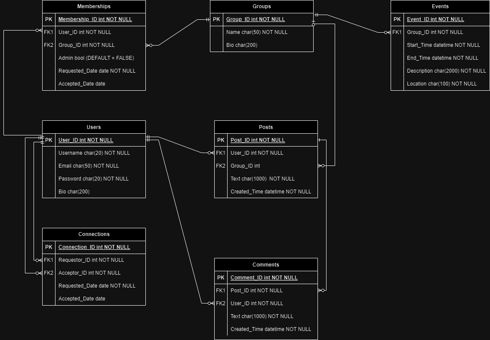

# T2A2 - API Webserver Project - Lukas Halloran
## Problem Identification and Discussion
There are various social media apps available to the public. These have often increased in features and functionality over time. The problem identified is that a user may desire a simple Text-Based Social Media app that does not contain images, and other additional features, advertisements or content. By creating a simple Text-Based Social Media app, this problem can be solved.

In creating a simple Text-Based Social Media app, an API is required to store and modify relational data in a database, and access this data through API routes. The API solves this problem by providing the routes and endpoints to access and modify this data. The API endpoints could then be accessed using a front-end user interface, not included in this webserver project.

## Relational Database Management System
The database management system (DBMS) used for this project is PostgreSQL. PostgreSQL is a relational Database Management System, referring to the ability to encode relationships between the various data tables / app models. This is particularly useful when applied to data with various relationships, in this case: Users create Posts, and Connect with other Users, for example. PostgreSQL has some trade-offs compared to other DBMS, for instance it is generally slower than MySQL, due to a focus on data integrity and reliability. PostgreSQL is also widely considered more complex than MySQL, which can make it more difficult to use for beginners or learn from the documentation. Given that PostgreSQL provides many features, this is seen as a better option in this case.

## Object Relational Mapper
This app uses the Object Relational Mapper SQLAlchemy. ORMs are used to 'map' between the database representation of app data (SQL in this case) and the programming language representation (in Python) by creating a layer of abstraction. Using an ORM means that data can be accessed in a form that is consistent with the application code, and is familiar to the developer, rather than accessing the database SQL or DBMS PostgreSQL directly. The use of ORMs can save a lot of time, improve readability and reduce the risk of developer errors.

## Endpoints
This API provides the following endpoints:
### Users:
#### Register - POST method
<b>/users/register</b>

This endpoint allows a new user to register. Provide the following details in JSON format:

```js
{
    "username": "NewUser",
    "email": "newuser@email.com",
    "password": "newuser123",
    "bio": "Hi I'm new user, this is my bio"
}
```

The user will be registered and login, user and access token will be returned.

#### Login - POST method
<b>/users/login</b>

This endpoint allows an existing user to login. Provide the following details in JSON format:

```js
{
    "username": "NewUser",
    "password": "newuser123"
}
```

The user will login, user and access token will be returned.

#### User Page - GET method
<b>/users/username</b>

This endpoint returns the info and posts of the user determined by username provided in URL. Access token must be provided. Users can only access their own user page, or user pages of connected users.
The user info and posts will be returned.

#### Update user info - PUT method
<b>/users</b>

This endpoint allows a user with valid login to update their user info. Access token must be provided. Users can only access their own user page, or user pages of connected users.Provide the following details in JSON format:

```js
{
    "username": "NewUser",
    "email": "newuser@email.com",
    "password": "newuser123",
    "bio": "Hi I'm new user, this is my bio"
}
```

The user name and new access token will be returned.

#### Delete user - DELETE method
<b>/users</b>

This endpoint allows a user with valid login to delete their account. Access token must be provided.
Route will return a confirmation that user has been successfully deleted.

### Connections
#### Request - POST method
<b>/users/connections/request/acceptor_id</b>

This endpoint requests a new connection between two users, requestor - current login user (Access Token required), and acceptor - determined by user_id provided in URL. If a request does not exist, one will be created. The other user will then need to accept the connection before the users are connected.
Endpoint returns created connection details.

#### Get Connections - GET method
<b>/users/connections?accepted=true</b>

This endpoint returns a list of all connections for the current user (login required).
Optional 'accepted' argument in URL filters connections:
accepted=true: only accepted connections are shown.
accepted=false: only not yet accepted connections are shown.
If accepted argument is omitted, all connections are returned.

#### Accept - PUT method
<b>/users/connections/accept/requestor_id</b>

This endpoint accepts an already existing connection between the acceptor (current login) and requestor (provided in URL).
Endpoint returns accepted connection details.

#### Delete - DELETE method
<b>/users/connections/delete/other_user_id</b>

This endpoint allows either user in a connection to delete a connection. One user is provided by current login, and the other by other_user_id field in URL.
Confirmation will be returned if the connection is deleted.

### Posts
#### Create Post - POST method
<b>/posts?group=Group1</b>

This endpoint allows a logged in user to create a new post, with optional 'group' URL argument if the post is in a group.
Provide the following details in JSON format:

```js
{
    "text": "This is the post text"
}
```

Resulting post will be returned.

#### Get Posts - GET method
<b>/posts</b>

This endpoint returns a list of posts in JSON format.

#### Update Post - PUT method
<b>/posts/id</b>

This endpoint allows a logged in user to update their own post, determined by id provided in URL.
Provide the following details in JSON format:

```js
{
    "text": "This is the post text"
}
```

Resulting post will be returned.

#### Delete Post - DELETE method
<b>/posts/id</b>

This endpoint allows a logged in user to delete their own post, determined by id provided in URL.

Confirmation will be returned.

### Comments
#### Create Comment - POST method
<b>/posts/id</b>

This endpoint allows a logged in user to comment on a post, where the post is determined by the id provided in URL.

Provide the following details in JSON format:

```js
{
    "text": "This is the post text"
}
```

Resulting comment will be returned.

#### Delete Comment - DELETE method
<b>/posts/post_id/comments/comment_id</b>

This endpoint allows a logged in user to delete a comment, where the post is determined by the post_id, and comment determined by the comment_id, provided in URL.

Deleted comment will be returned.

### Groups
#### Create Group - POST method
<b>/groups/</b>

This endpoint allows a logged in user to create a new group. The user will also become a member of the group with admin priviliges automatically. Provide the following details in JSON format:

```js
{
    "name": "NewGroup",
    "bio": "This is the group bio"
}
```

Resulting group will be returned.

#### Group Page - GET method
<b>/groups/name</b>

This endpoint allows an accepted member of the group to get the group info and posts, where group is determined from 'name' in the URL. Resulting group details will be returned.

#### Update Group - PUT method
<b>/groups/name</b>

This endpoint allows an admin member of the group to update the group info, where group is determine from 'name' in URL. Provide the following details in JSON format:

```js
{
    "name": "UpdatedGroup",
    "bio": "This is the updated group bio"
}
```

Updated group will be returned.

#### Delete Group - DELETE method
<b>/groups/name</b>

This endpoint allows an admin of the group to delete the group, determined by 'name' in URL. Confirmation that the group has been deleted will be returned.

### Memberships
#### Request Membership - POST method
<b>/groups/group_name/memberships</b>

This endpoint allows a logged in user to request a new membership in a group, determined by URL 'group_name'.
Resulting membership will be returned.

#### Get Memberships - GET method
<b>/groups/group_name/memberships?accepted=true</b>

This endpoint returns a list of all memberships for the current group (admin login required).
Optional 'accepted' argument in URL filters memberships:
accepted=true: only accepted memberships are shown.
accepted=false: only not yet accepted memberships are shown.
If accepted argument is omitted, all memberships are returned.

#### Accept Membership - PUT method
<b>/groups/group_name/memberships/user_name</b>

This endpoint allows a group admin to accept a membership request, determined by group_name and user_name in URL. Resulting membership is returned.

#### Delete Membership - DELETE method
<b>/groups/group_name/memberships/user_name</b>

This endpoint allows a group admin to delete a membership, determined by group_name and user_name in URL. Confirmation will be returned.

## Entity Relationship Diagram (ERD)


## Third Party Services
- Flask - for app creation
- Flask_SQLAlchemy - ORM
- Flask_Marshmallow - Object serialization/deserialization using JSON
- Flask_Bcrypt - Password encryption
- Flask_JWT_Extended - JSON Web Token
- Datetime - used for dates and times for models.

## App Models
- User: creates posts, comments on posts, connects with other users, has memberships in groups.
- Connections: connects two users together.
- Posts: created by users, can be a group post or not, users can comment on posts.
- Comments: created by users, attached to specific posts.
- Groups: users have memberships in groups, groups have group posts.
- Memberships: users have memberships in groups, user who creates a group is admin.

## Database Relations
As shown in ERD:
- User/User: Many to Many optional, hence Connection table for Many to Many relationship, requestor and acceptor Foreign Keys.
- User/Post: One to Many optional, Foreign Key user_id in Posts.
- User/Comment: One to Many optional, Foreign Key user_id in Comments.
- Post/Comment: One to Many optional, Foreign Key post_id in Comments.
- User/Group: Many to Many optional, hence Memberships table for Many to Many relationship, requestor and acceptor Foreign Keys.
- Group/Post: One optional to Many optional, optional group_id in Posts.
